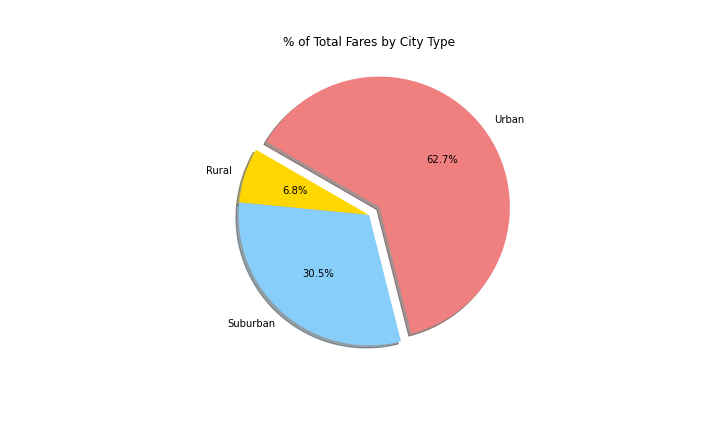

# PyBer_Analysis

## Table of Contents
- [Overview of Project](#OverviewProject)
  * [Purpose](#purpose)
- [Results](#Results)
  * [Scatter Plot](#scatter)
  * [Box and Whisker Plots](#boxw)
  * [Pie Charts](#piechart)
  * [Line Chart](#linechart)
- [Summary](#Summary)
- [Resources](#Resources)

## Overview of Project

Pyber, a ride sharing app, wants an exploratory analysis of the data using visualization.  The data to be analyzed includes the city where the ride took place, the date, number of drivers per city,  the type of city for every city (suburban, urban and rural) for 2019 [[3]](#3)[[4]](#4). We will use this opportunity to determine affordability for underserved neighborhoods. 

### Purpose

As part of the analysis we would determine the following paramenters:
 - The relationship between the average fare per city and the total number of rides per city. 
 - We will create whisker and box plots with:
   * Number of rides per city type,
   * Average ride fare per city type, 
   * Number of drivers per city type. 
 - We will explore the percentage of:   
   * Total rides per city type,
   * Total fares per city type, 
   * Drivers per city type. 
 - We will look into trends fares per city type over a period of 4 months.   

We used python and matplotlib to create the analysis [[1]](#1)[[2]](#2).

## Results

### Scatter Plot

  

 Figure 1: Pyber Ride Sharing Data (2019) 
 

### Box and Whisker Plots

  

 Figure 2: Ride Count Box and Whisker Plot 
 

  

 Figure 3: Ride Fare Box and Whisker Plot 
 

  

 Figure 4: Driver Count Box and Whisker Plot 
 

### Pie Charts

  

 Figure 5: Percentage of Total Fares per City Type 
 

  

 Figure 6: Percentage of Total Rides per City Type 
 

  

 Figure 7: Percentage of Total Drivers per City Type 
 

### Line Charts

In this graph we can see that although there is no noticeable tren of when the prices will increase or decrease, except maybe a slight peak towards the end of February, the tital fares of urban cities are always about 3-4 times higher than those of rural cities, and suburban cities are about twice as high as rural cities. Urban cities always compromise the majority of the total fares Pyber has. 

  

 Figure 8: Pyber Fare Summary
 

##  Summary

In general the price of the fares for rural areas is higher than in suburban and urban areas. Yet there's less number of rides and drivers in rural areas than in suburban and urban areas. This could be due to distances being longer in rural areas, therefore increasing the price of the ride. Additionally rural areas are less densely populated therefore decreasing the availability of drivers and number of rides. Yet discounts in rural areas could incentivize the users to increase the number of rides which overtime could improve the profits for drivers. 

## Resources

<a name="1">[1]</a> [Analysis Code 1 (Challenge)](https://github.com/tamiespinosa/PyBer_Analysis/blob/8ebcdeea678b7b5232dd7a593e6c8d62eb9b900a/PyBer_Challenge.ipynb)

<a name="1">[2]</a> [Analysis Code 2](https://github.com/tamiespinosa/PyBer_Analysis/blob/8ebcdeea678b7b5232dd7a593e6c8d62eb9b900a/PyBer.ipynb)

<a name="2">[3]</a> [City Data](https://github.com/tamiespinosa/PyBer_Analysis/blob/8ebcdeea678b7b5232dd7a593e6c8d62eb9b900a/Resources/city_data.csv)

<a name="3">[4]</a> [Ride Data](https://github.com/tamiespinosa/PyBer_Analysis/blob/8ebcdeea678b7b5232dd7a593e6c8d62eb9b900a/Resources/ride_data.csv)

[5] https://docs.github.com/en/get-started/writing-on-github/getting-started-with-writing-and-formatting-on-github/basic-writing-and-formatting-syntax
